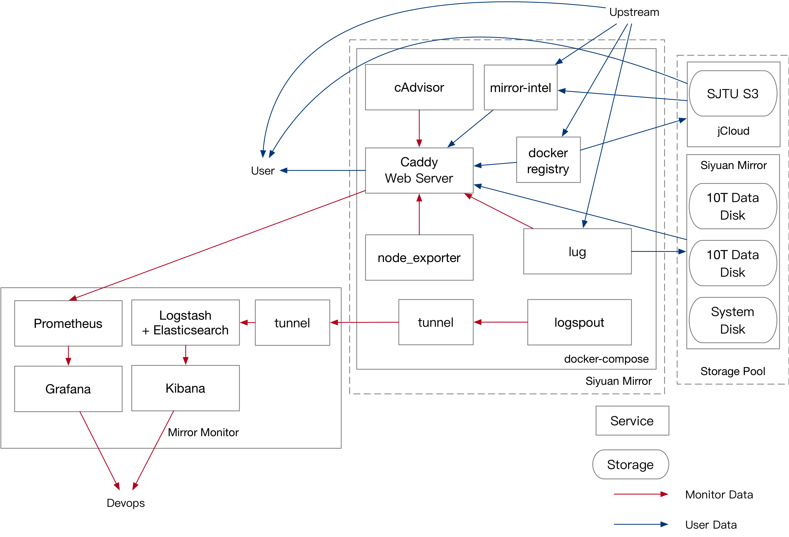

# mirror-docker-unified

Dockerfile for the all SJTUG mirror servers.

## Docs



For more information, refer to our [Wiki](https://github.com/sjtug/mirror-docker-unified/wiki).

## Project structure & maintenance

```sh
.
├── apache # apache dockerfile
├── caddy
├── caddy-gen # caddy configuration generator (for ./caddy)
├── clash # clash dockerfile (for secured connection with monitor node)
├── common # common network configuration
├── data # caddy & lug backend dist
├── docs # Documentation
├── frontend # lug frontend (Next.js)
├── gateway-gen # rsync-sjtug configuration generator (for ./rsync-gateway)
├── git-backend # git backend
├── integration-test # test
├── lug # lug backend dockerfile
├── mirror-intel # mirror-intel configuration
├── rsync-gateway
├── rsyncd
├── scripts
├── secrets
└── upstream
```

Python version, treefmt, pre-commit configurations are controlled by `devshell.toml` with Nix flakes.

See <https://nixos.org/download/> or <https://lix.systems/install/> for Nix installation manual.

`devshell.toml`

```toml
[python]
version = "3.13" # major-minor version
workspaces = ["caddy-gen", "gateway-gen", "integration-test"] # Python workspaces with uv.lock

# ...
```

## License

Apache 2.0
