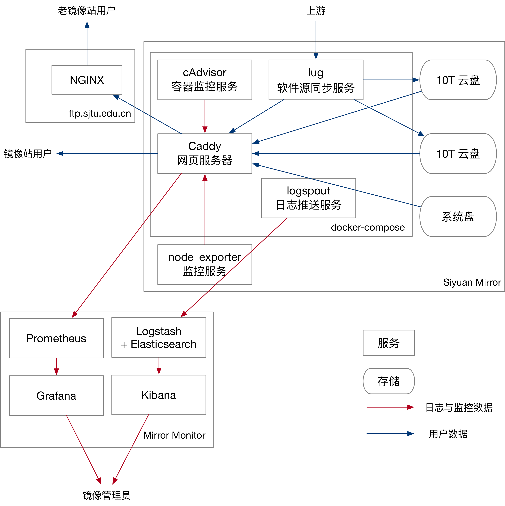

# SJTUG Siyuan Mirror

本项目目标是将 ftp.sjtu.edu.cn 镜像站上云迁移到新服务器。目前项目已进行到第三阶段。镜像站可以在交大内网通过 http://mirrors.internal.skyzh.xyz 访问。

## 项目目标

- 上线 mirrors2.sjtug.sjtu.edu.cn，与 ftp.sjtu.edu.cn 的 HTTP 服务器具有相同功能。（不迁移 ftp，目前的发行版均使用 HTTP 协议下载文件）
- 在新镜像上配置镜像同步与监控服务。
- 将 ftp.sjtu.edu.cn 无缝迁移到 mirrors2.sjtug.sjtu.edu.cn。

## 项目架构




## 项目协作

迁移项目的全过程都在 GitHub 上开放。在 https://github.com/sjtug/mirror-docker-siyuan 的提交记录中看到整个迁移过程。下面也会介绍整个迁移计划。

## 项目计划

### Stage 1: 可行性验证

在可行性验证阶段，计划搭建一个只含有 Ubuntu 的镜像源（Ubuntu 约 1.5T），从而验证上云的可行性。

需求

- jCloud 云服务器，最小 CPU/内存配置，100G 系统盘，2T 云盘，先使用组员自己的账号开通。

具体步骤

- 装系统 (Chi)
- 从 ftp.sjtu.edu.cn 同步 ubuntu 镜像 (需要 SSH 读权限，可使用 rsync 同步) (Chi)
- 在新镜像上启动同步服务和 Web 服务器 (Chi)
- 配置相关防火墙策略 (Yimin)
- 配置 Web 服务器 (Ziqi)

### Stage 2: 新镜像上线

需求

- jCloud 云服务器，一般的 CPU/内存配置
- 沿用 100G 系统盘
- 挂载 30T 云盘 (可以挂多块盘，比如 3\*10T) (目前 ftp.sjtu.edu.cn 大约使用了 25T 空间)
- 怀疑 ftp.sjtu.edu.cn 中有没有删除的旧数据，理论上目前 ftp 上的镜像应该不至于使用这么多空间。
- 将云服务器迁移到学校账户管理
- mirrors2.sjtug.sjtu.edu.cn 需要修改 DNS 解析

具体步骤

- 从 ftp.sjtu.edu.cn 同步其他镜像 (Debian, UbuntuCD, DebianCD, etc.) (Chi)
- 配置同步服务从官方源同步镜像 (Yimin)
- 配置日志服务，将镜像 log 传到 SJTUG 监控机 (Ziqi)
- 将 mirrors.sjtug.sjtu.edu.cn 的部分镜像重定向到新镜像 (Chi)
- 完善新镜像前端。 (Chi)

### Stage 3: 无缝迁移

#### 上线

目前新镜像站已经可以在交大内网通过 http://mirrors.internal.skyzh.xyz 访问，所有镜像均已从官方上游成功同步。
常用发行版的镜像也已经测试可以正常使用。镜像站已经达到上线要求。

上线需要网络中心协助：

- 将云服务器绑定到公网 IP
- 将 mirrors2.sjtug.sjtu.edu.cn 解析到该 IP (A + AAAA)
- 为云服务器绑定 IPv6 地址

绑定公网 IP 和域名后，迁移小组将通过 Let’s Encrypt 自动申请证书，完成网站的上线工作。

#### 迁移

经测试，发行版包管理器均支持 HTTP 重定向下载文件。因此，采用 301 重定向的方式进行迁移。迁移后，

- 新镜像服务器、老镜像服务器都需要运行。
- 用户无需修改已有的配置。
- 老镜像服务器通过 HTTP 301 将流量发送到新服务器上。
- 老镜像服务器的硬盘可以回收。
- 迁移小组会更新使用文档，使得未来使用镜像站的用户都直接访问新镜像服务器。

这一步需要 ftp.sjtu.edu.cn 的管理老师协助修改老服务器上的 NGINX 配置。在原配置上增加一行 return 即可。

```
return 301 $scheme://mirrors2.sjtug.sjtu.edu.cn$request_uri;
```

#### 失败回退

迁移可能出现失败的情况。唯一可能迁移失败的地方可能在于 NGINX 服务器不兼容、或新服务器无法正确处理转发的请求。

在迁移后，迁移小组会用脚本跑测试 https://github.com/sjtug/mirror-test-scripts。
测试需要一分钟左右。如果发现有问题，可以回退 NGINX 配置并重启 Web 服务器，完成失败回退的过程。
如果迁移失败，不可用时间可以控制在 5 分钟以内，不会对用户的正常使用造成影响。

### Stage 4: 完善新镜像

新镜像的定位是：

- 提供原 ftp.sjtu.edu.cn 的 HTTP 服务。
- 其他国内高校开源镜像（如 mirrors.tuna, mirrors.ustc）暂未上线的服务，以提高带宽利用率。（比如 crates.io 全量同步，OPAM）
- 校内师生使用较多的镜像。通过校内镜像缓存可以显著提升使用体验的服务。（比如 Python 语言的 pypi 镜像，以及课程中会用到的，比如 dart, flutter 等软件学院课程使用到的镜像）

新镜像预计上线这些服务：

- Rust 语言的 crates.io 全量同步镜像。Rust 语言是现在流行的系统编程语言，SJTUG 目前通过反向代理提供服务，效果不太好。在新镜像上可以尝试全量同步。
- OCaml OPAM 镜像和 Coq OPAM 镜像。OCaml 函数式编程语言在校内有许多教师同学使用，但国内一直没有相关镜像。因此 Chi Zhang 开发了 https://github.com/sjtug/mirror-clone 用于同步 OPAM 源，可以在新镜像上上线。
- pypi 全量同步镜像。校内 Python 用户很多，全量同步 pypi 可以提升校内使用体验。pypi 镜像大约需要 8T 空间，可以在新镜像上采用仅同步最新版本包的方法提升空间利用率。

### Stage 5: 提升镜像性能

- 减少镜像同步所需要的扫盘操作，通过缓存文件列表的方式降低同步带来的 IO 开销。
- 使用 jCloud 对象储存作为储存后端，减少大量碎片小文件带来的储存开销。
